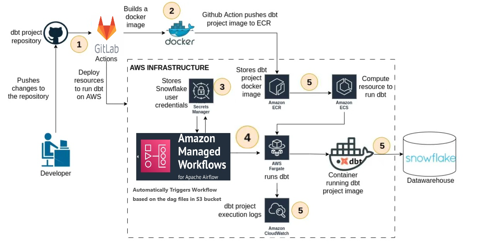

# Professional Guide: Deploying dbt Projects on AWS ECS Fargate with GitLab and Terraform

This document outlines a comprehensive and professional approach to deploying a dbt project on AWS ECS Fargate using a CI/CD pipeline built with GitLab and Terraform. It serves as a demonstration of the deployment process and highlights the best practices for leveraging AWS services and other integrated tools effectively.

---

## **Overview**

Dbt (data build tool) has evolved into a fundamental and integral component in any modern data stack built at top cloud data warehouses such as Snowflake, BigQuery, or Redshift. Its primary function is to efficiently organize and orchestrate the business logic applied to the data within a data warehouse. 

Dbt can be deployed in a production environment using a custom infrastructure that includes dedicated CPU resources for running the dbt models. Therefore, this article introduces a demo CI/CD pipeline that automatically constructs a Docker image of a dbt project whenever a change is pushed to a Git repository. Subsequently, this Docker image is registered in an AWS ECR repository to operate within a container on AWS ECS.

   

The above dbt deployment architecture leverages a seamless CI/CD workflow that integrates GitLab, Terraform, Docker, and AWS services. Changes pushed to the GitLab repository trigger the pipeline to build a Docker image encapsulating the dbt project, which is stored in Amazon ECR. Terraform automates the creation of AWS infrastructure, including ECS Fargate, where the container runs. Airflow DAGs, stored in Amazon S3 and orchestrated by MWAA, schedule and execute the dbt container, retrieving credentials securely from AWS Secrets Manager. MWAA also send logs to cloudwatch for debuging purpose. The outputs are written to Snowflake, ensuring a secure, scalable, and automated data transformation process.

In this project i have leverage the power of GitLab’s OIDC (OpenID Connect) integration, by which we can securely retrieve temporary AWS credentials without long-term keys, ensuring maximum security throughout the process. 

The deployment incorporates modern, secure methods such as GitLab OIDC for credential management and integrates seamlessly with services like Snowflake and MWAA (Managed Workflows for Apache Airflow).

---

## **AWS Services Utilized**

- **Amazon S3**: For storing Airflow DAG files and other artifacts.
- **IAM**: To manage permissions securely for ECS-Fargate and MWAA.
- **Secrets Manager**: To securely store and manage sensitive credentials like Snowflake login details.
- **Security Groups**: To control inbound and outbound network traffic.
- **ECR**: For Docker image storage and management.
- **ECS Fargate**: To run containerized workloads without managing servers.
- **MWAA (Managed Workflows for Apache Airflow)**: For orchestrating and scheduling workflows.
- **CloudWatch**: For logging and monitoring.

## **Integrated Tools and Services**

- **GitLab**: For source control and CI/CD pipeline execution.
- **Terraform**: For Infrastructure as Code (IaC) automation.
- **Docker**: To containerize the dbt project.
- **Snowflake**: As the target data warehouse.

---

## **Key Features of the Solution**

1. **Secure Credential Management**:
   - GitLab OIDC is used to retrieve temporary AWS credentials via JWT, eliminating the need for long-term access keys.
   - Snowflake credentials (username, password, account details) are securely stored in AWS Secrets Manager, ensuring sensitive information is protected.

2. **Workflow Orchestration**:
   - MWAA retrieves Snowflake credentials from Secrets Manager and triggers the execution of the dbt project container on ECS Fargate.
   - DAGs in MWAA manage execution schedules, frequency, and task logic. Output tables are generated in Snowflake as a result of Airflow execution.

3. **Containerization**:
   - The dbt project is encapsulated in a Docker image to ensure consistency and portability.
   - The image is stored in an ECR repository for seamless deployment to ECS Fargate.

4. **Infrastructure as Code (IaC)**:
   - Terraform automates the creation of all infrastructure components except for the Secrets Manager, which is configured manually via the AWS console.

5. **Scalability and Maintainability**:
   - The solution accommodates multiple dbt workstreams efficiently by leveraging MWAA.
   - The design is modular and reusable for similar deployment scenarios.

---

## **GitLab Pipeline Stages**

1. **Infrastructure Stage (IaC)**:
   - Create the required AWS infrastructure using Terraform by running the pipeline.

2. **DAG Logic Stage**:
   - Retrieve outputs from Terraform.
   - Update the DAG file with these outputs.
   - Create the DAG folder and push the DAG file to the S3 bucket.

3. **Build Image Stage**:
   - Use a Docker-in-Docker (dind) image to execute Docker commands in the pipeline.
   - Build the Docker image encapsulating the dbt project and push it to the ECR repository.

4. **Destroy Stage**:
   - Run this stage manually to destroy all infrastructure when required.

4. **Default Stage**:
   - This stage will run by default if no changes where made to IAC or project folder and in case you want to run the pipeline.

---

## **Advantages of the Solution**

- **Security**: Enhanced by using GitLab OIDC and AWS Secrets Manager.
- **Automation**: Simplifies the deployment process with CI/CD and Terraform.
- **Flexibility**: Supports different execution frequencies and logic configurations via Airflow DAGs.
- **Scalability**: Easily accommodates multiple dbt workflows with MWAA.
- **Integration**: Seamlessly connects with Snowflake, ECR, and ECS.

---

## **Conclusion**

This document presents a streamlined and professional approach to deploying dbt projects on AWS ECS Fargate through GitLab and Terraform. By following this solution, professionals can achieve efficient, secure, and scalable deployments while leveraging the capabilities of AWS and integrated tools. The accompanying code [repository](https://gitlab.com/sharafat678/dbt-deployment#) further aids in understanding and replicating this deployment process.

